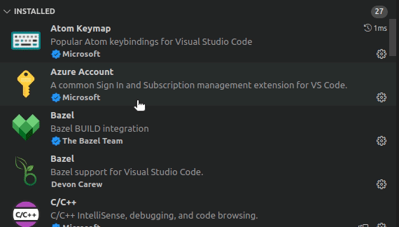

# vscode-config
My VScode settings, configs, and plugins

*A convenient location for keeping it synced across multiple development environments*



## Quicksetup

```shell
git clone git@github.com:onescriptkid/vscode-config.git
pushd vscode-config > /dev/null
./extensions.sh
cp settings.json ~/.config/Code/User/settings.json
```
## [settings.json](./settings.json)
```json
{
    "window.zoomLevel": -1,
    "python.linting.flake8Path": "~/Envs/venv/bin/flake8",
    "python.linting.pylintPath": "~/Envs/venv/bin/pylint",
    "editor.bracketPairColorization.enabled": true,
    "atomKeymap.promptV3Features": true,
    "editor.multiCursorModifier": "ctrlCmd",
    "editor.formatOnPaste": true,
    "editor.minimap.enabled": false,
    "editor.insertSpaces": false,
    "vim.handleKeys": {
        "<C-c>": false,
        "<C-v>": false,
        "<C-f>": false,
        "<C-a>": false,
        "<C-x>": false,
        "<C-n>": false,
        "<C-y>": false
    },
    "editor.cursorStyle": "line",
    "editor.lineNumbers": "on",
    "editor.wordSeparators": "/\\()\"':,.;<>~!@#$%^&*|+=[]{}`?-",
    "javascript.updateImportsOnFileMove.enabled": "always",
    "search.followSymlinks": false,
    "explorer.confirmDragAndDrop": false,
    "editor.wordWrap": "on",
    "editor.tabSize": 2,
    "[python]": {
        "editor.insertSpaces": true,
        "editor.tabSize": 4
    },
    "[shell]": {
        "editor.insertSpaces": true,
        "editor.tabSize": 4
    },
    "[javascript]": {
        "editor.insertSpaces": true,
        "editor.tabSize": 2
    },
    "[json]": {
        "editor.insertSpaces": true,
        "editor.tabSize": 2
    },
    "[go]": {
        "editor.insertSpaces": true,
        "editor.tabSize": 4
    }
}

```

## [Extensions](./extensions.sh)

```shell
code --install-extension BazelBuild.vscode-bazel
code --install-extension cssho.vscode-svgviewer
code --install-extension dbaeumer.vscode-eslint
code --install-extension DevonDCarew.bazel-code
code --install-extension DotJoshJohnson.xml
code --install-extension dsznajder.es7-react-js-snippets
code --install-extension eamodio.gitlens
code --install-extension EditorConfig.EditorConfig
code --install-extension golang.go
code --install-extension lihui.vs-color-picker
code --install-extension ms-azure-devops.azure-pipelines
code --install-extension ms-azuretools.vscode-docker
code --install-extension ms-python.python
code --install-extension ms-vscode.atom-keybindings
code --install-extension ms-vscode.azure-account
code --install-extension ms-vscode.cpptools
code --install-extension ms-vsliveshare.vsliveshare
code --install-extension naumovs.color-highlight
code --install-extension PKief.material-icon-theme
code --install-extension peterj.proto
code --install-extension Tchoupinax.tilt
code --install-extension timonwong.shellcheck
code --install-extension redhat.ansible
code --install-extension redhat.vscode-yaml
code --install-extension wholroyd.jinja
code --install-extension wix.vscode-import-cost
code --install-extension yzhang.markdown-all-in-one
code --install-extension vscodevim.vim
```
